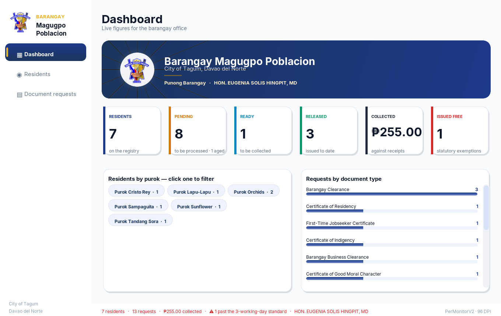

# Barangay Resident and Document Request Management System — v3.1.3

**Barangay Magugpo Poblacion, City of Tagum, Davao del Norte**
Windows desktop application · WinForms · .NET 8

---

## Group

| Member |
|---|
| Dagamac, Emmanuelle Philippe |
| Del Rosario, Jonathan F. |
| Gado, Clint Wood |
| Raborar, Frent Dhieniel |

---

## Running it

**Visual Studio 2022:** open **`BarangayDocumentSystem.slnx`** — the XML
solution — set **BarangayDocumentSystem** as the startup project if it is
not already the only one, and press **F5**. On Visual Studio 17.10–17.12
the `.slnx` format needs the *"Use the XML solution format"* preview
feature enabled (Settings → Environment → Preview Features); 17.13 and
later read it out of the box.

**Opening the solution.** `.slnx` opens **natively on Visual Studio 2022
17.13+, including the current 17.14 builds** — no preview toggle. It does
*not* launch by double-click the way `.sln` does, so use *File → Open →
Project/Solution*. On 17.10–17.12 enable the XML-solution preview feature
first; on anything older (or whenever the pane comes up empty), open
**`BarangayDocumentSystem.sln`** — the classic format beside it, same two
projects, same GUIDs. Open one or the other, never both. Full checklist:
[`docs/06` §10](docs/06-pushing-to-github.md).

```bash
dotnet run --project BarangayDocumentSystem
```

Requires the **.NET 8 SDK** with the **".NET desktop development"**
workload. Sample data loads on start — no database needed. The project
references **no NuGet packages**, so it builds with no network at all.

> `tests/RuleChecks` is a console harness, not the app. If Visual Studio
> says *"a project with an Output Type of Class Library cannot be started
> directly"*, the startup project is wrong. That setting lives in a
> gitignored file, so **every teammate must set it once after cloning.**

---

## What changed in v3.1

| | v3 | **v3.1** |
|---|---|---|
| Structure | 2 projects (`src/Core`, `src/App`) | **1 project** with the layers as folders |
| Solution | `.sln` | **`.slnx`** (XML) |
| Document types | 20 | **24** — the four charter money services added |
| Business Clearance | flat ₱200 | **VARIES with the law violated**; ₱200 standard |
| Cedula | — | **₱5 + ₱1/₱1,000 sworn income** (RA 7160 §156) |
| Filing a case | — | **₱150** (Katarungang Pambarangay) |
| Barangay facilities | — | **₱200/hr**, hour or part |
| Taripa items | — | **assessed**, with the item stated |
| RA 11261 | covers the certificate | **covers the clearance too**, once |
| Documents | monospaced text preview | **GDI+ templates** + true print preview + printing |
| Receipts | — | **printed** with amount and legal basis |
| Queue | status only | **RA 11032 aging** — 3 working days flagged |
| Fees basis text | `"DILG MC 2019-177"` for indigency | **corrected** — RA 11291; see docs/07 |

The full legal reference behind every peso — the charter rates, the four
waivers and exactly where each stops, and the other barangay laws read
while building this — is
[`docs/07-fee-schedule-and-legal-basis.md`](docs/07-fee-schedule-and-legal-basis.md).

---

## What changed in v3.1.1

The v3.1.1 round reviewed and folded in the completed work from Jonathan F.
Del Rosario's `Draft` branch, keeping this project's structure as the one
codebase. His branch itself is *not* merged — it was a parallel .NET
Framework rewrite — but its genuinely new ideas were ported and adapted:

| | v3.1 | **v3.1.1** |
|---|---|---|
| Rejecting a request | plain text prompt | **dedicated `RejectionForm`** — names the request, warns that a paid request keeps its payment (no refunds), validates the reason |
| "Record payment" | **silently recorded nothing** — the OK click never applied the receipt to the request | **fixed** — the receipt number is written onto the request, and the queue's Paid column tells the truth |
| Receipt numbers | trusted the clerk | **unique across requests** (case-insensitive), enforced by the store (`IBarangayRepository.ReceiptNumberExists`) |
| Unhandled errors | vanished with the process | **logged** to `%LOCALAPPDATA%\BarangayDocumentSystem\errors.log` (`Helper/ErrorLogger`), with a plain explanation on screen |
| Rule checks | 49 | **63** — rejection rules, payment guards, receipt uniqueness (ported from Jonathan's Draft test suite) |
| Persistence design | verbal hand-waving | **reviewed and recorded** — his SQL layer's ideas (provisioning lock, schema versioning, optimistic concurrency, filtered unique indexes, resident snapshots) mapped onto the MySQL schema in [docs/05 §9](docs/05-database-guide.md) for V3.2 |
| Manual demo script | — | **[docs/08-demo-walkthrough.md](docs/08-demo-walkthrough.md)** — the pre-defence click-through |

Not carried over, deliberately: his branch's ₱50 classroom fee rates (the
charter rates stand — see [docs/07 §VI](docs/07-fee-schedule-and-legal-basis.md)),
its 7-document subset (all 24 services stay), its SQL Server LocalDB
runtime (MySQL remains the protocol engine), and its parallel folder
structure. Nothing from Phillippe Dagamac's `draft3` branch is included —
that work is still TBD.

---

## What changed in v3.1.3

A UI/UX and compatibility round, grounded in what a teammate's machine
actually did:

- **Bundled fonts, actually shipped.** **Inter Regular + Bold now live in
  `Assets/fonts/`** (SIL Open Font License — see `OFL-Inter.txt` there) and
  are loaded first via `PrivateFontCollection`, so the brand face renders
  identically on every machine, installed or not. Symbol codepoints (the
  sidebar glyphs) draw in a dedicated `SymbolFamily` face, because Inter
  does not carry them.
- **Keyboard navigation.** `Ctrl+1 / 2 / 3` jump Dashboard / Residents /
  Document requests; the shell is now fully keyboard-drivable.
- **The RA 11032 clock is always visible.** The status bar turns the
  danger colour and reads `⚠ N past the 3-working-day standard` the
  moment any open request breaches it; the Pending tile shows `· N aged`.
- **Accessibility.** Every clickable stat card carries an
  `AccessibleName` a screen reader can speak.
- **VS 17.14 (2026) guidance.** `.slnx` is GA there — see `docs/06` §10
  for the version-aware open checklist (and why double-click fails).

---

## What changed in v3.1.2

The dashboard was aligned to the team's modern-dashboard design
specification. The structure it specifies — hero banner with the seal in a
circular frame, six accent-barred stat cards, purok chips, document-type
bars, sidebar with rounded active state — **already existed**; this round
retunes the exact palette and typography, all in `Helper/AppTheme.cs`:

| Token | Was | Now (spec) |
|---|---|---|
| Canvas / Ink / Muted | `#F5F7FC` / `#0B142B` / `#636C80` | **`#F8FAFC` / `#0F172A` / `#64748B`** |
| Hero banner navy | `#0A1F54` | **`#1B365D`** (gradient anchor) |
| Residents / Pending / Ready / Released / Collected / Free accents | seal-derived | **`#1E3A8A` / `#D97706` / `#0284C7` / `#059669` / `#1E293B` / `#DC2626`** |
| Stat value | 40px | **36px** (spec 34–38) |
| Stat header | 12px | **11px uppercase** (`Overline`) |
| Font stack | — | **Plus Jakarta Sans** added between Inter and SF Pro |

The seal's gold stays, and WinForms caps at Bold — no ExtraBold/Black
weights and no letter-spacing exist on the platform; sizes and casing are
exact. `docs/dashboard-preview.png` was regenerated to match.

---

## What changed in v3.1.5

A stability-and-structure round on the dashboard, under the team's
refactor safety constraints (source files only; designer code untouched):

- All of `DashboardView`'s styling now lives in one dedicated
  **`ApplyModernUIStyles()`** method called at the end of the constructor,
  after the structural setup — the same pattern the designer-backed forms
  follow with `BuildUi()`/`ApplyTheme()` after `InitializeComponent()`.
  Structure, parenting and event wiring stay in the constructor, so a
  restyle can never re-parent or re-wire anything.
- **The six-card grid no longer wraps** at the default 1360×860 window:
  the tile floor drops 178 → 160px (six 178px tiles needed 1138px inside
  a 1056px pane; six 160px tiles need 1030px). The reference preview in
  `docs/dashboard-preview.png` is regenerated at the default window size
  to prove it.

---

## The six core technical fixes

1. **Designer support.** `packages.config` lists the accessibility
   assemblies the designer surface looks for; every form is a `partial`
   class with a parameterless constructor and an `InitializeComponent`, so
   Visual Studio opens `MainShell`, `ResidentForm`, `RequestForm`,
   `PaymentForm` and `DocumentPreviewForm` on its design surface.
2. **High-DPI, three agreeing places.** `ApplicationHighDpiMode` /
   `PerMonitorV2` in the `.csproj` (applied by
   `ApplicationConfiguration.Initialize()`), the `dpiAwareness` block in
   `app.manifest`, and a documented section in `App.config`.
3. **Modern fonts.** Since v3.1.3 **Inter ships with the app**
   (`Assets/fonts/`, SIL OFL) and is loaded before anything else; the
   resolver falls back through **SF Pro → Roboto → Segoe UI Variable →
   Segoe UI** for machines without the bundled files. All custom drawing
   runs through ClearType.
4. **Responsive gridding.** `UiFactory.Grid` builds TableLayoutPanels with
   **percentage** columns; every dialog and card row reflows instead of
   clipping.
5. **Smooth scrolling.** `SmoothPanel` sets `WS_EX_COMPOSITED` and
   double-buffering; every scrolling surface in the app is one.
6. **Multi-monitor preview.** `MainShell` and `DocumentPreviewForm` handle
   `WM_DPICHANGED` — the suggested window rectangle is applied, the shell
   restyles, and the preview rescales its zoom with the DPI ratio.

---

## Fees actually charged

| Service | Fee |
|---|---|
| Barangay Clearance — local employment | ₱100 |
| Barangay Clearance — for work abroad | ₱200 |
| Certification (residency, good moral, other) | ₱100 |
| Certificate of Indigency | FREE |
| Certificate of Low Income | FREE |
| Business Clearance | **VARIES** with the law violated — ₱200 standard |
| Cedula | **VARIES** — ₱5 + ₱1 per ₱1,000 sworn gross income |
| Filing a case (Katarungang Pambarangay) | ₱150 |
| Barangay facilities | ₱200/hr |
| Other processing fees (Barangay Taripa) | assessed per item |

Waivers on top, on personal certificates only: **RA 9994** senior citizens ·
**RA 10754** PWDs · **RA 11291** indigents · **RA 11261** first-time
jobseekers (six months' residency, once only, certificate *and* clearance).
The regulatory amounts — business, cedula, filing, facilities, Taripa — are
never waived, and the rule checks prove it.

---

## Project layout

One project; the dependency arrow points inward — the views know the rules,
the rules know nothing of the views.

```
BarangayDocumentSystem/
├── BarangayDocumentSystem.slnx       ← open this
├── BarangayDocumentSystem.sln        ← fallback for VS < 17.10
├── README.md
├── docs/
│   ├── 01-requirements.md            scope, FR, NFR, the v3.1 changes (§VI)
│   ├── 02-erd.svg                    entity relationship diagram
│   ├── 03-uml.svg                    UML class diagram
│   ├── 04-project-timeline.md        the plan
│   ├── 05-database-guide.md          running the MySQL scripts (+ §9: the reviewed persistence design)
│   ├── 06-pushing-to-github.md
│   ├── 07-fee-schedule-and-legal-basis.md   every fee and its law
│   └── 08-demo-walkthrough.md        the manual pre-defence click-through
├── db/
│   ├── 01-schema.sql                 tables, triggers, views (v3.1 columns)
│   └── 02-seed-data.sql              the same residents as the demo
├── BarangayDocumentSystem/                    net8.0-windows
│   ├── Assets/fonts/     Inter Regular + Bold, bundled under the SIL OFL
│   │                     — the brand face on every machine (v3.1.3)
│   ├── App.config        every setting that might change
│   ├── app.manifest      PerMonitorV2 + supportedOS
│   ├── packages.config   designer accessibility listing
│   ├── Program.cs        composition root + the config reader
│   ├── MainShell(.Designer).cs     the window, WM_DPICHANGED
│   ├── NavigationSidebar.cs         the left rail
│   ├── DashboardView.cs   ResidentsView.cs   RequestsView.cs   ViewBase.cs
│   ├── ResidentForm.cs    RequestForm.cs
│   ├── PaymentForm.cs     (receipt printing)
│   ├── RejectionForm.cs   (the no-refunds rejection dialog, v3.1.1)
│   ├── DocumentPreviewForm.cs      (scaled print preview)
│   ├── Prompt.cs         quick input prompts
│   ├── Models/           Resident, DocumentRequest (state machine + fees), Enums, BarangayProfile
│   ├── Interfaces/       IBarangayRepository (incl. receipt uniqueness, v3.1.1), IDocumentTemplate
│   ├── Service/          FeeSchedule, DisplayFormat, DocumentRenderer
│   │   └── Templates/    one class per document wording
│   ├── DBContext/        InMemoryBarangayRepository (swap for MySQL later)
│   └── Helper/           AppTheme, UiFactory, Dialog, InputValidator, ErrorLogger (v3.1.1)
└── tests/
    └── RuleChecks/       runnable checks against the charter and the laws
```

---

## Settings — `BarangayDocumentSystem/App.config`

Everything that might change lives here, so nobody has to rebuild to adjust a
fee or a name.

| Key | Meaning |
|---|---|
| `Storage` | `Memory` (sample data, the default) or `MySQL` |
| `Barangay.*` | Name, city, province, Punong Barangay, office hours |
| `Fee.*` | The charter rates — clearance local/abroad, certification, business standard, lupon filing, facility hourly, community tax base/per-₱1,000/cap |
| `Rule.JobseekerResidencyMonths` | The RA 11261 residency requirement |
| `Rule.RA11032.SimpleWorkingDays` | The aging standard in the request queue |
| `BarangayDb` | The MySQL connection string |

**Leave `Storage` on `Memory` unless you are testing the database** — see
[`docs/05-database-guide.md`](docs/05-database-guide.md).

---

## Database

`db/01-schema.sql` then `db/02-seed-data.sql`, run in that order in
phpMyAdmin or MySQL Workbench. Full instructions, including the common
errors and what they mean, are in
[`docs/05-database-guide.md`](docs/05-database-guide.md).

The C# class that talks to MySQL is **not in this build yet**. If you set
`Storage=MySQL` the app tells you so plainly and starts on the sample data
rather than pretending. The v3.1 columns are already in the schema:
`assessed_amount`, `hours_of_use`, `declared_income`, `fee_detail` and
`availed_jobseeker_act`.

---

## Interface

Modelled on a digital-government service concept: white canvas,
lavender-blue gradients, rounded cards, pill buttons, heavy headings — set
in **Inter** when the machine has it.



**Everything is clickable.** Dashboard stat cards jump to the filtered list
they summarise; purok chips open the residents of that purok; resident rows
show that person's request history underneath; double-clicking a request
opens the printable document.

**It adapts to the screen.** The window takes 92% of the available work area
up to 1360×860 and never below 1000×640; PerMonitorV2 scaling is on, with
`WM_DPICHANGED` handled in the shell and the preview; every view scrolls
(rather than clipping) on a composited, double-buffered surface; grids fill
their width; dialogs are percent-gridded and resizable with minimum sizes.

---

## Verified

```
dotnet build  →  0 errors   (single project + rule checks)

42 C# files parse-checked with the Roslyn grammar (tree-sitter);
the checks below are what to run on Windows:

  real purok names · Peña renders with ñ intact
  clearance ₱100 local · ₱200 abroad · certification ₱100
  indigency FREE · low income FREE · assistance papers FREE
  business VARIES — 500 assessed under a violated ordinance stands
  cedula ₱5 + ₱1/₱1,000 — ₱120,000 income → ₱125 · capped at ₱5,005
  cedula REFUSED for a minor (RA 7160 §156)
  lupon filing ₱150 · facilities 2.5 h → 3 × ₱200 = ₱600
  Taripa item required and priced
  senior waived (RA 9994) · PWD waived (RA 10754) · indigent (RA 11291)
  senior STILL pays the business fee, the cedula, the filing fee
  RA 11261: 14 months allowed · 2 months blocked with a reason
  RA 11261 on the CLEARANCE too — released once, second claim blocked
  unpaid fee-bearing release REFUSED · released after payment
  rejection rules: reason required · rejected is terminal · released never rejected
  a rejected payment keeps its receipt AND the collection total
  payment guards: nothing due on a free document · a request pays once
  receipt numbers unique across requests, case-insensitive
  RA 11032: working days counted · 6 calendar days flagged past 3
  all 24 document types named, templated, and rendered on the letterhead
  reference BMP-2026-0007 · real Punong Barangay on the certificate
  no placeholder text anywhere
```

Run them yourself: `dotnet run --project tests/RuleChecks`.

## Not verified — please read

- **The UI has never been launched.** Everything compiles and every file
  parses, but running WinForms needs Windows and this was built on Linux.
  Run it before the defence.
- **The MySQL scripts have not been executed** against a real server.
- The checks are a console harness, not a unit-test framework.

## Before submitting

- [ ] Run it on Windows and click through every screen
- [ ] Take screenshots for the documentation
- [ ] Set **BarangayDocumentSystem** as the startup project
- [ ] Each member fills in their own row of `docs/04-project-timeline.md`
- [x] ~~Confirm the ₱200 business clearance rate~~ — it **varies**; ₱200 is
      the standard rate and the clerk assesses violations
