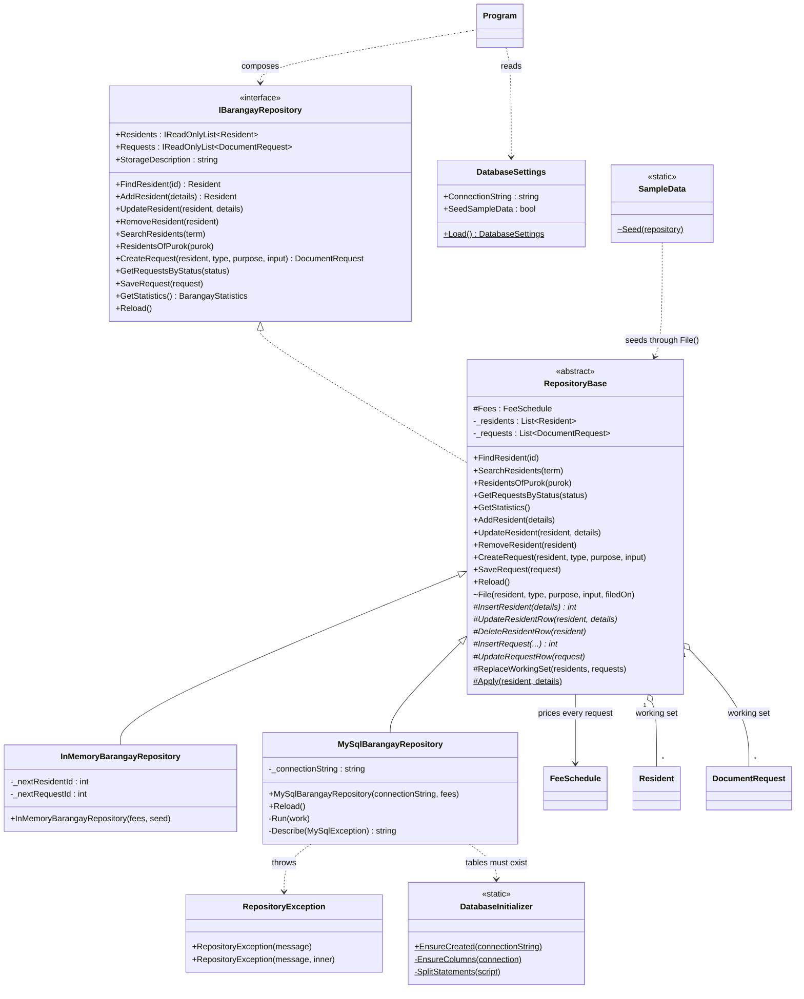
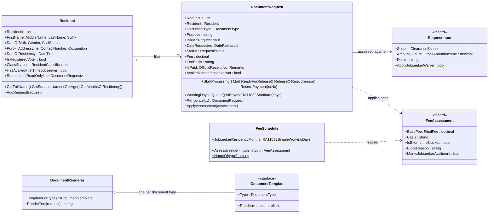
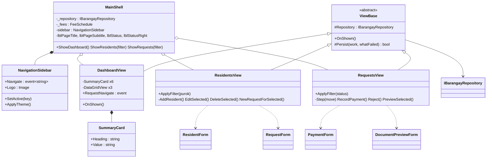
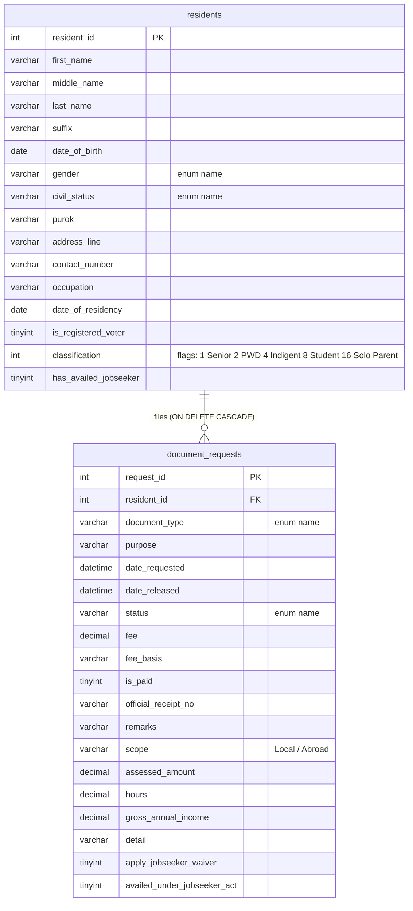

# Object Model — v3.2 (the drafts integrated on the Fdraft baseline)

*Written by Clint Wood Gado.* This is the object-oriented model I built the
code from: which classes exist, what each one is responsible for, how they
relate, and where each SOLID and DRY decision lives. Diagrams are Mermaid, so
GitHub renders them and they can be updated with a text editor.

Who made which part is recorded on every source file in a header
(`PART / ORIGIN / EDITS`). The short version:

| Part | Whose work | Where it lives |
|---|---|---|
| Project structure, MySQL persistence | **Frent Dhieniel Raborar** (`Fdraft`) | the folder layout, `Database/MySqlBarangayRepository`, `DatabaseInitializer`, `DatabaseSettings`, `schema.sql`, `Interfaces/RepositoryException` |
| Screen design: flat sidebar, page title, status strip, six summary cards, three breakdown tables | **Jonathan F. Del Rosario** (`Draft`) | `CustomControls/NavigationSidebar`, `CustomControls/SummaryCard`, `Views/DashboardView`, the `MainShell` layout |
| Rules and regulations, palette, logo, models, documents, the shared repository skeleton, tests, docs | **Clint Wood Gado** (`leader_draft`) | `BusinessRules/*`, `Models/*`, `Interfaces/IBarangayRepository`, `Database/RepositoryBase`, `Database/InMemoryBarangayRepository`, `Database/SampleData`, `UIHelpers/*`, `Forms/*`, `tests/RuleChecks` |

---

## 1. The layers

```text
 Views / Forms / CustomControls            what the clerk sees        (Jonathan's design, my palette)
        │  depend only on
 Interfaces  (IBarangayRepository, IDocumentTemplate, RepositoryException)
        │  implemented by                          ▲ used by
 Database   (RepositoryBase → InMemory | MySql)    BusinessRules (FeeSchedule, templates, renderer)
        │  both work on                            │
 Models     (Resident, DocumentRequest, RequestInput, enums, BarangayProfile)
```

The arrow of dependency always points inward. A screen never names
`MySqlBarangayRepository`; `Program.cs` is the only file that does.

---

## 2. Class diagram — persistence



`*` = abstract hook, `~` = internal, `$` = static, `#` = protected.

**Template Method.** `RepositoryBase` owns the *skeleton* of every command:
validate → persist (hook) → mirror in the working set. The in-memory
repository's hooks hand out counter ids and do nothing else; the MySQL
repository's hooks run Frent's parameterised SQL. The *queries* are written
once in the base, because both storages answer them from the same working
set. Before this, `Apply`, `SearchResidents`, `GetStatistics` and the whole
seed existed twice, once per repository.

---

## 3. Class diagram — domain and rules



Status transitions are guarded inside `DocumentRequest`
(`Pending → Processing → ReadyForRelease → Released`, any open state
`→ Rejected`, release refused while a fee is unpaid). The screens mirror
those rules to enable buttons; they do not re-implement them.

---

## 4. Class diagram — the screens (Jonathan's design, my palette)



---

## 5. Entity–relationship model (what MySQL stores)



Two tables, Frent's design, plus the seven columns my `RequestInput` and
`AvailedUnderJobseekerAct` need so a request loads back exactly as it was
assessed. Enum *names* are stored, never their numbers, so reordering an
enum can never silently change what a row means. The classification stays a
bit-flag integer because that is what the C# model is and what Frent's
repository reads in one line; the normalised junction-table design I drew
in v3.1 is recorded in `docs/05` as future work, not implemented twice.

---

## 6. Sequence — filing a request through to release

```mermaid
sequenceDiagram
    actor Clerk
    participant RV as ResidentsView
    participant RF as RequestForm
    participant Repo as RepositoryBase (MySql)
    participant Fees as FeeSchedule
    participant DB as MySQL

    Clerk->>RV: New request
    RV->>RF: ShowDialog(resident, fees)
    RF->>Fees: Assess(resident, type, input)   (live, as the type changes)
    Fees-->>RF: FeeAssessment (fee, basis, blocked?)
    RF-->>RV: OK: type, purpose, input
    RV->>Repo: Persist(() => CreateRequest(...))
    Repo->>Fees: Assess(resident, type, input)   (the store prices it itself)
    Repo->>DB: INSERT document_requests (...)
    DB-->>Repo: request_id
    Repo-->>RV: DocumentRequest (Pending, fee, basis)

    Clerk->>RequestsView: Start processing / Mark ready / Record payment / Release
    RequestsView->>DocumentRequest: guarded transition (may throw InvalidOperation)
    RequestsView->>Repo: Persist(() => SaveRequest(request))
    Repo->>DB: BEGIN; UPDATE document_requests; UPDATE residents.has_availed_jobseeker; COMMIT
    alt MySQL fails
        Repo-->>RequestsView: RepositoryException
        RequestsView->>Repo: Reload()
        RequestsView-->>Clerk: "was not saved" + the reason
    end
```

---

## 7. Where SOLID and DRY actually are

I only claim a principle where a file demonstrates it.

| Principle | Where | What would break it |
|---|---|---|
| **S**ingle responsibility | `FeeSchedule` prices; `DocumentRequest` guards state; `RepositoryBase` stores; `DocumentRenderer` lays out; `AppSettings` reads config; `Dialog` speaks to the user | a fee amount typed into a form; a status set from a screen |
| **O**pen/closed | a new document = one `IDocumentTemplate` class + one enum value (`DocumentRenderer` unchanged); a new storage = one `RepositoryBase` subclass (`Program.cs` changes one line, no screen changes) | a `switch` on document type inside the renderer; `if (repo is MySql...)` in a view |
| **L**iskov substitution | `InMemoryBarangayRepository` and `MySqlBarangayRepository` are interchangeable behind `IBarangayRepository`; the RuleChecks harness runs the same rules on the in-memory one | a storage whose `SaveRequest` silently drops changes |
| **I**nterface segregation | `IBarangayRepository` (storage), `IDocumentTemplate` (one document), `FeeSchedule` is a class the templates read rates from — no screen is forced to depend on SQL types | `MySqlConnection` on the interface |
| **D**ependency inversion | screens and forms receive `IBarangayRepository` and `FeeSchedule` through constructors; `Program.cs` is the composition root | `new MySqlBarangayRepository()` inside a view |
| **DRY** | one `Apply`, one `SearchResidents`, one `GetStatistics`, one `SampleData`, one `StyleGrid` (`UiFactory`), one config reader (`AppSettings`), one schema (`schema.sql`), one palette (`AppTheme`), one set of fee numbers (`App.config` → `FeeSchedule`) | the same seven residents typed into two seeders (that is what I removed) |
